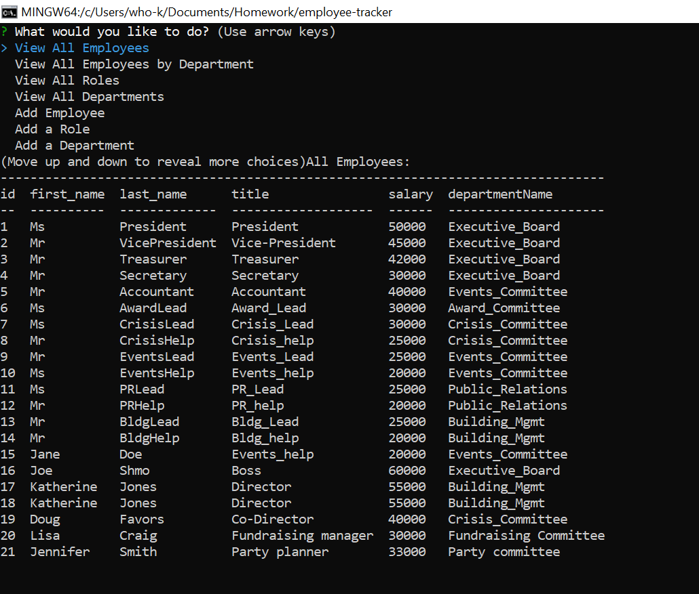

# employee-tracker

## Table of Contents
<!--ts-->
   * [Project Description](#project-description)
   * [Technologies Used](#technologies-used) 
   * [Dependencies](#dependencies)
   * [Tests](#tests)
   * [Using Repo](#using-repo)
   * [Contributing to the repo](#contributing-to-the-repo)
   * [Licenses](#licenses)
   * [Inquiries](#inquiries)
   * [Developer Info](#developer-info)
<!--te-->
## Project Description
An Employee Management System application that can be used to manage a company's employees using node, inquirer and MySQL database

Project url: 
(https://github.com/wayele/employee-tracker)

## Screenshots
CLI prompts and table 

## Technologies Used
Javascript, Node JS, Inquirer, and MySQL

## Dependencies
npm install
## Tests
no test
## Using Repo
install all dependencies, application could use optimization
## Contributing to the repo
any contributions to optimize and improve functionality is always welcomed. Contact me
## Licenses

MIT
## Inquiries
Yes

ayele.wub@gmail.com
## Developer Info:

Github username: wayele

Email: ayele.wub@gmail.com
